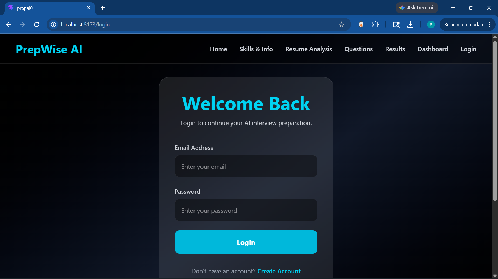
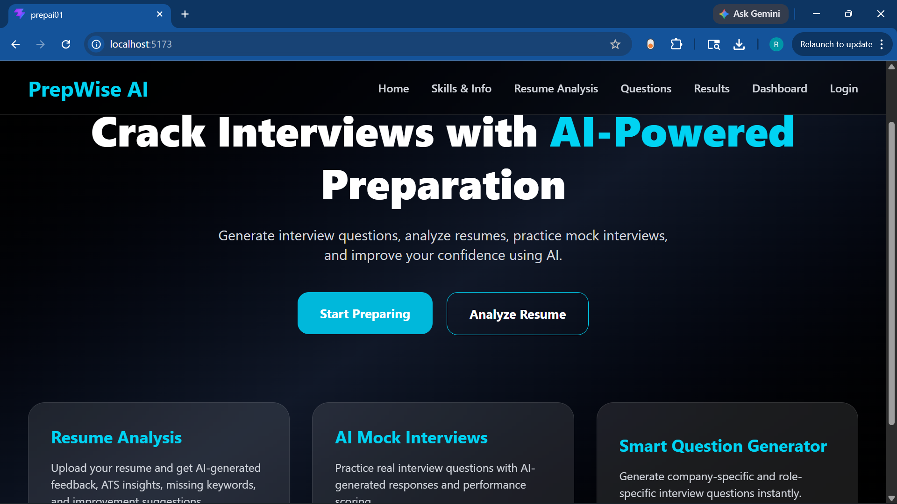
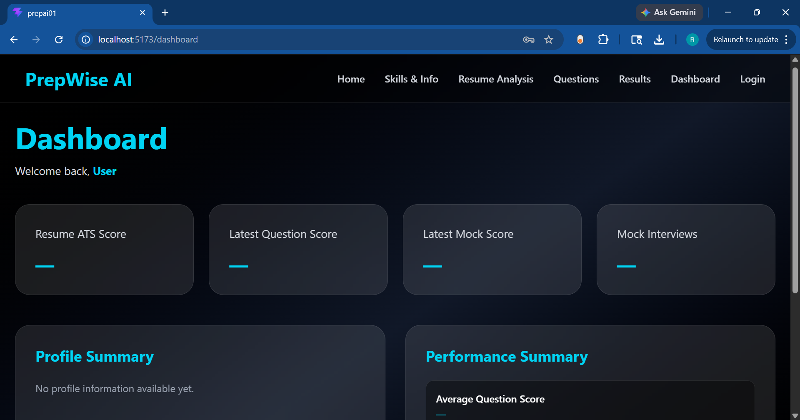
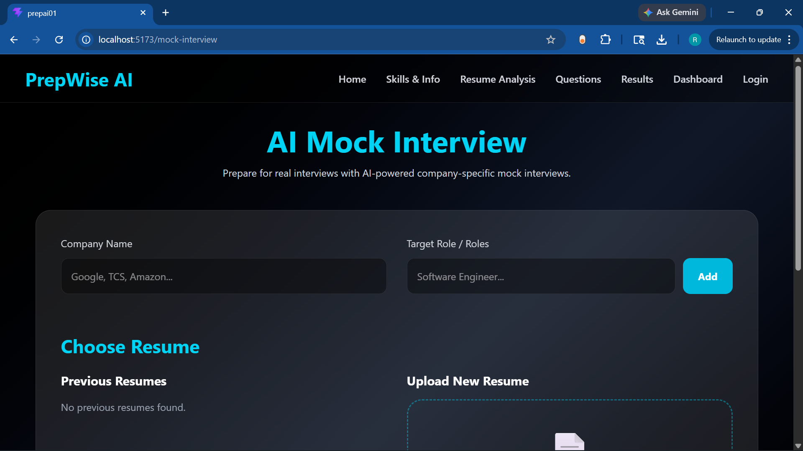
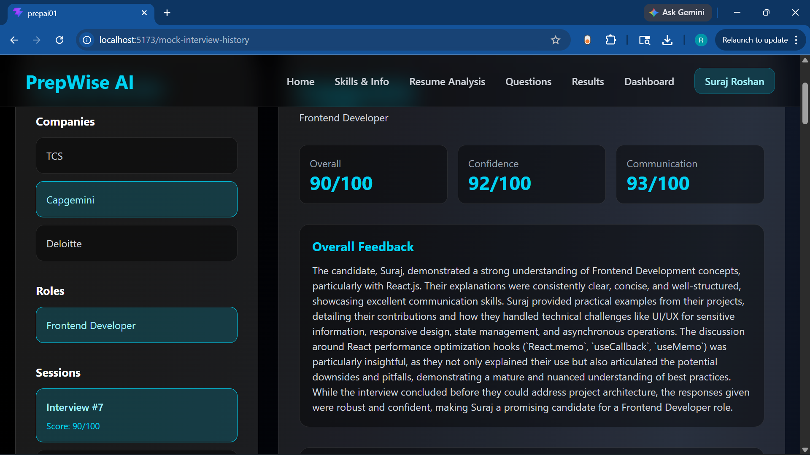

# AI-Powered Interview Preparation Platform

An AI-powered mock interview platform that helps users practice technical and HR interviews through AI-generated questions, real-time answer evaluation, and intelligent feedback analysis.

---

## Features

- JWT Authentication System
- AI-generated Interview Questions
- Voice-based Interview Interaction
- AI Answer Evaluation
- Real-time Feedback & Scoring
- Role & Skill-based Interview Setup
- Full-stack Web Application
- Responsive User Interface

---

## Tech Stack

### Frontend
- React.js
- Vite
- Axios
- React Router DOM

### Backend
- Flask
- Python
- REST APIs
- JWT Authentication

### Database
- MongoDB

### AI Integration
- Gemini API

---

## Project Structure

```bash
PREPAI01/
│
├── backend/
│   ├── app.py
│   ├── db.py
│   ├── requirements.txt
│
├── frontend/
│   ├── public/
│   ├── src/
│   ├── package.json
│   ├── vite.config.js
│
├── screenshots/
│
├── .gitignore
├── README.md
```

---

## Installation & Setup

### Clone the Repository

```bash
git clone https://github.com/SurajRoshan1122/ai-interview-preparation-platform.git
```

```bash
cd ai-interview-preparation-platform
```

---

# Backend Setup

Move to backend folder:

```bash
cd backend
```

Create virtual environment:

### Windows

```bash
python -m venv venv
venv\Scripts\activate
```

### Linux / Mac

```bash
python3 -m venv venv
source venv/bin/activate
```

Install dependencies:

```bash
pip install -r requirements.txt
```

Create `.env` file inside backend folder:

```env
GEMINI_API_KEY=your_api_key
JWT_SECRET_KEY=your_secret_key
MONGO_URI=your_mongodb_connection
```

Run backend server:

```bash
python app.py
```

---

# Frontend Setup

Open another terminal:

```bash
cd frontend
```

Install dependencies:

```bash
npm install
```

Start frontend server:

```bash
npm run dev
```

---

## Environment Variables

### Backend `.env`

```env
GEMINI_API_KEY=
JWT_SECRET_KEY=
MONGO_URI=
```

---

## Application Workflow

1. User registers/login
2. User selects role and skills
3. AI generates interview questions
4. User answers questions
5. AI evaluates responses
6. Feedback and score are displayed

---

## AI Features

- Dynamic Question Generation
- AI-based Answer Verification
- Intelligent Feedback System
- Technical & HR Interview Support
- Multi-question Evaluation

---

## Security Features

- JWT Authentication
- Protected Routes
- Secure API Communication
- Environment Variable Protection

---

## Screenshots

### Login Page



---

### Home Page



---

### Dashboard



---

### Interview Interface



---

### Feedback System



---

## Future Improvements

- Resume Parsing
- Interview History Tracking
- Webcam-based Monitoring
- AI Improvement Suggestions
- Cloud Deployment
- Docker Support
- Analytics Dashboard

---

## Deployment Options

### Frontend
- Vercel
- Netlify

### Backend
- Render
- Railway
- AWS EC2

### Database
- MongoDB Atlas

---

## Author

### Suraj Roshan Sahoo

- GitHub: https://github.com/SurajRoshan1122

---

## License

This project is created for educational and portfolio purposes.